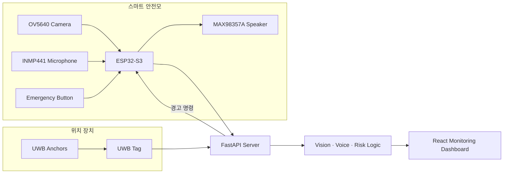

# 🦺 HANMIR — 산업용 AI 스마트 안전모

<div align="center">


**작업자의 보호구 착용·위치·위험 상황을 감지하고 작업자와 관리자에게 전달하는 HW·AI·관제 통합 시스템**

[프로젝트 개요](#-프로젝트-개요) • [핵심 기능](#-핵심-기능) • [시스템 구조](#-시스템-아키텍처) • [문제 해결](#-핵심-문제-해결) • [구현 경계](#-현재-구현-경계)

</div>

---

## 📌 프로젝트 개요

**HANMIR**는 산업 현장 작업자의 보호구 착용 여부, 위치와 위험 상황을 실시간으로 확인하고 음성으로 경고하기 위한 스마트 안전모 프로젝트입니다.

ESP32-S3 기반 카메라·마이크·스피커 장치, UWB 위치 장치, 비전 AI, FastAPI 서버와 React 관제 화면을 하나의 데이터 흐름으로 연결했습니다. 개발 환경에서 동작하는 개별 기능을 단순히 모으는 데 그치지 않고, 실제 배경과 배선·핀 배치·전원·접지 조건에서 발생한 문제를 분리해 개선하는 데 초점을 맞췄습니다.

---

## ✨ 핵심 기능

| 기능 | 구성 |
| --- | --- |
| 보호구 판별 | 카메라 영상에서 인물과 보호구 상태 분석 |
| 위험 안내 | 감지 결과와 음성 에이전트를 연동해 작업자에게 경고 |
| 위치 관제 | UWB 태그·앵커 데이터를 이용한 작업자 위치 표시 |
| 긴급 이벤트 | 버튼 입력과 위험 상황을 서버·관제 화면에 전달 |
| 장치 상태 확인 | heartbeat, RSSI, 배터리와 부품 상태를 진단 화면에서 확인 |

---

## 🏗️ 시스템 아키텍처



---

## 🔧 핵심 문제 해결

### 1. 실제 작업 배경에서 저하된 보호구 인식

- 개발 환경에서는 동작하던 보호구 인식이 복잡한 실제 작업 배경에서 흔들리는 문제를 확인했습니다.
- 현장 배경 이미지를 학습 데이터에 추가했습니다.
- 전체 화면에서 보호구부터 찾는 대신 인물 영역을 먼저 분리하고 보호구를 판별하도록 인식 순서를 조정했습니다.

### 2. 카메라 핀과 오디오 신호선 충돌

- 카메라용 핀에 오디오 신호선이 함께 연결되면서 마이크 잡음이 발생했습니다.
- ESP32-S3 데이터시트와 핀맵을 확인해 사용 가능한 여유 핀을 찾았습니다.
- 오디오 신호선을 해당 핀으로 재배선해 카메라와 오디오 신호 경로를 분리했습니다.

### 3. 전원·접지 조건에 따른 마이크 노이즈

- 신호선 변경 후에도 남는 잡음을 배선·전원·접지 구간으로 나눠 점검했습니다.
- 전원·접지 배선을 정리하고 커패시터를 추가했습니다.
- 변경 후 마이크 입력과 전체 시스템 동작을 반복 확인했습니다.

---

## 🧰 기술 구성

| 구분 | 사용 기술·부품 |
| --- | --- |
| Embedded HW | ESP32-S3-CAM, OV5640, INMP441, MAX98357A, Button |
| Position | UWB Tag/Anchor, 거리 데이터 기반 위치 계산 |
| AI | YOLO 기반 보호구 인식, 음성 에이전트 연동 |
| Backend | Python, FastAPI, SQLite, WebSocket |
| Frontend | React, TypeScript, Vite |
| Verification | Serial log, heartbeat API, server log, HW diagnostic dashboard |

---

## 📁 저장소 구조

```text
safe-halmat-capston-/
├── firmware/
│   ├── helmet_av_device/       # 카메라·마이크·스피커·버튼
│   ├── uwb_position_device/    # 안전모 UWB 태그
│   └── uwb_anchor/             # 현장 고정 UWB 앵커
├── backend/                    # FastAPI·위험도·위치·이벤트·진단
├── frontend/                   # React 관제 Dashboard
├── simulator/                  # 실제 API 형식의 mock 데이터
├── sample_data/                # 지도·앵커·위험구역·테스트 이미지
└── docs/                       # 제작·배선·실행·협업 가이드
```

---

## 🚀 실행 방법

Windows 환경에서 다음 파일로 통합 환경을 구성하고 실행할 수 있습니다.

```bat
install_windows.bat
run_all.bat
```

- Frontend: `http://localhost:5173`
- API 문서: `http://localhost:8000/docs`
- 실제 UWB 연동: `run_hardware_map.bat COM6` (`COM6`는 장치 포트에 맞게 변경)

세부 순서는 [`통합_시작가이드.md`](통합_시작가이드.md)와 [`docs/PROJECT_A_TO_Z_GUIDE.md`](docs/PROJECT_A_TO_Z_GUIDE.md)를 참고하세요.

---

## 🧪 소프트웨어 검증

```bat
cd backend
..\.venv\Scripts\python -m pytest

cd ..\frontend
npm run build
```

실물 장치에서는 펌웨어 시리얼 로그, heartbeat API, 서버 로그와 관제 화면의 하드웨어 진단 정보를 함께 확인합니다.

---

## ⚠️ 현재 구현 경계

README가 구현 완료 범위를 과장하지 않도록 실제 장치와 mock 구간을 구분합니다.

- YOLO 모델 파일이 없으면 dummy detection 구조를 사용합니다.
- 음성 인식 엔진이 설치되지 않은 환경에서는 dummy STT를 사용합니다.
- DW3000 보드·라이브러리가 확정되지 않은 환경에서는 UWB mock adapter를 사용합니다.
- ESP32-S3의 카메라·오디오 GPIO는 실제 보드 핀맵을 기준으로 충돌 여부를 다시 확인해야 합니다.

세부 결선 상태는 [`docs/CURRENT_HARDWARE_WIRING_STATUS.md`](docs/CURRENT_HARDWARE_WIRING_STATUS.md), 통합 결과는 [`INTEGRATION_SUMMARY.md`](INTEGRATION_SUMMARY.md)를 참고하세요.

---

## ✅ 프로젝트 결과

- 실제 배경을 반영한 보호구 인식 흐름 개선
- ESP32-S3 카메라·오디오 핀 충돌을 데이터시트 확인과 재배선으로 개선
- 전원·접지 배선 정리와 커패시터 추가 후 마이크 입력 반복 점검
- 비전 AI·음성 안내·UWB 위치·관제 화면을 하나의 시스템 구조로 통합
