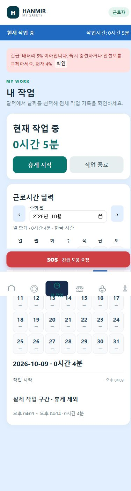

# 근로자 앱 기능 확장 · v1.7 / build 8

## 구현 항목

| 요청 | 반영 화면 및 동작 |
|---|---|
| 1. 관리자 근무 상태 구분 | 관리자 모바일 대시보드 전체 근무 현황, 작업자 관리·상세의 작업 중/휴게 중/작업 전·종료 표시 |
| 2. 근로자 실시간 지도 | 하단 내 위치 메뉴, 해당 현장 배치도·위험구역·출구·장애물과 본인 위치만 표시. 약 2초 갱신, UWB 신호가 오래되면 마지막 위치로 구분 |
| 3·10. 날짜별 근로시간·모든 기록 | 내 작업의 월별 달력, 일자 선택 시 해당 날짜의 시작·휴게·재개·종료 전체 기록 및 작업 구간 표시 |
| 4. 팀 채팅 | 같은 현장·같은 배정 팀의 근로자·관리자 대화. 서버 저장, 약 2초 갱신, 이전 대화 조회 |
| 5. 교육·작업 허가 | 관리자 등록 교육/허가, 필수 여부·이수/승인·유효기간 관리. 근로자는 내 정보에서 조건 확인. 필수 미이수·미승인·만료 또는 비인가자는 시작/재개 제한 |
| 6. 소속·배정 | 내 정보에 이름·배정 현장·소속 회사·팀·직책·작업자 ID 표시 |
| 7. 시작 전 점검 | 안전모·작업 조끼·장갑 체크 모두 완료해야 시작 가능. 서버에도 확인 기록 저장 |
| 8. 작업 중 배경·배너 | 작업 중 파란 배경, 모든 탭 상단에 상태 및 오늘 누적 작업시간. 휴게 중에는 별도 색상과 상태 표시 |
| 9. 배터리 알림 | 실제 연결·최근 수신 값 기준 20% 주의·10% 경고·5% 긴급 충전 알림. 같은 단계의 반복 알림 억제 |

## 관리자 설정

1. 관리자 로그인 후 **작업자 관리**로 이동합니다.
2. 작업자 카드의 **소속·직책·교육·작업 허가·팀 채팅 관리**를 펼칩니다.
3. 소속 회사, 팀, 직책을 입력합니다. 예: 직책 `현장반장`.
4. 필요한 교육/작업 허가 항목을 추가하고 이수/승인·필수·유효기간을 지정해 저장합니다.
5. 해당 카드의 팀 채팅은 그 작업자가 배정된 팀과 연결됩니다.

새로 등록하지 않은 소속은 미등록, 팀은 현장팀, 직책은 기존 작업 역할로 표시합니다. 특정 회사명이나 교육 이수 사실을 임의로 등록하지 않습니다. 교육 이수·허가는 관리자가 확인한 기록이며 앱 안의 교육 강의/시험 기능은 포함하지 않습니다.

## 웹·폰·아이패드 공통 기능

- 첫 로그인 화면에서 왼쪽 관리자 / 오른쪽 근로자를 선택한 뒤 해당 로그인·회원가입 화면으로 이동합니다. 선택과 다른 역할의 계정은 안내 후 로그인 세션을 종료합니다.
- 근로자 팀 채팅 제목 옆 **관리자 통화** 버튼은 기존 안전모 통화 요청·응답 대기·부재중 처리 로직을 사용합니다. 관리자가 수신하면 안전모 마이크/스피커로 양방향 통화합니다. 일반 휴대전화 번호로 거는 기능은 아닙니다.
- 앱 SOS도 기존 관리자 긴급 배너·카메라 팝업·통화 버튼·신고 확인·상황 종료에 연결했습니다. 프레임이 없으면 기존 `No Frame` 표시를 사용하고 SOS 접수는 카메라 유무와 관계없이 가능합니다. 상황 종료 시 근로자 긴급 상태도 해제합니다.
- 이 변경의 웹 빌드·Android/iOS 동기화 및 SOS/통화 관련 테스트 9개를 확인했습니다. 실제 안전모 음성 통화는 연결된 하드웨어에서 확인해야 합니다.

- 같은 계정 역할은 기기에 관계없이 같은 기능과 서버 데이터를 사용합니다. 관리자는 PC 사이드바 또는 모바일 메뉴의 안전 관리에서 **팀 채팅**, **교육·작업 허가**를 직접 열 수 있습니다. 대시보드에도 바로가기를 제공합니다.
- 교육·작업 허가 메뉴에서 작업자를 선택하여 소속·팀·직책과 교육/허가 조건을 관리합니다. 근로자 계정은 본인 조건을 확인합니다.
- 관리자 통화·방송·화재 제어도 모든 화면 크기에서 제공합니다. 통화 티켓은 로그인한 관리자와 같은 현장 장치에만 발급합니다.
- 채팅은 **Enter 전송, Shift+Enter 줄바꿈**입니다. 한글 조합 확정과 전송 중 중복 입력은 전송을 발생시키지 않습니다.
- 달력의 ‘조회 월’ 문구를 제거하고 이전/다음 화살표와 월 선택을 같은 높이로 정렬했습니다.

## 시간·통신 기준

- 기록과 월/일 합계는 **Asia/Seoul (UTC+9)** 기준입니다.
- 휴게시간은 근로시간 합계에서 제외하고 자정을 넘긴 작업은 각 날짜로 나눕니다.
- 작업 중 배너는 매초 시간 표시를 갱신하고 서버 정보는 약 2초마다 확인합니다. 달력 합계는 약 30초마다 및 작업 상태 변경 시 갱신합니다.
- GPS 인터넷 지도 대신 기존 안전모 UWB 현장 좌표계를 이용합니다. 위치 신호가 없을 때 가짜 위치를 만들지 않습니다.
- 채팅과 근무 상태는 서버 연결이 필요합니다. 배터리 경고는 **앱을 열고 있을 때의 앱 내 알림**이며 OS 백그라운드 푸시는 포함하지 않습니다.
- 필수 교육/허가가 등록되지 않았으면 등록된 조건 없음으로 안내합니다. 조건 충족 표시가 법적 작업 자격을 자동 인증하는 것은 아닙니다.

## 저장 및 적용

새 `worker_assignments`, `worker_qualifications`, `team_messages` 테이블을 실제 DB에 추가했습니다. 기존 계정·근무 기록을 유지합니다. 초기 근로자 계정은 `WORKER / 0000`입니다.

백엔드 및 프론트엔드를 재시작하고 브라우저를 강력 새로고침하면 적용됩니다. 설치형 Android/iPad 앱에는 새 빌드 재설치가 필요합니다.

## 검증

- TypeScript·웹 빌드 및 Android/iOS 리소스 동기화
- 서버 자동화 테스트(`pytest tests -q`) **93개 통과**: 기존 기능 및 체크리스트·교육/허가 제한·채팅 권한·자정 계산·원격 관리자 통화 권한 포함
- 루트의 별도 YOLO/웹캠 실험 스크립트는 `ultralytics`/`cv2` 미설치로 전체 경로 수집 시 실행되지 않습니다.
- 브라우저에서 Enter 전송, Shift+Enter 줄바꿈과 PC·폰·태블릿 크기의 공통 메뉴를 확인했습니다. 실제 iPad 장치 재설치 검증은 포함하지 않습니다.
- 실제 브라우저 모바일 크기에서 체크리스트, 파란 배경/상단 배너, 달력, 지도, 소속/직책/교육, 20·10·5% 배터리 단계 확인
- 관리자 화면에서 근로자 작업 중 상태와 배정/교육/허가 편집 UI 확인
- 화면 검증은 **별도 임시 DB**를 사용했으며 실제 DB에 검증용 근무·배터리·교육 값을 넣지 않았습니다.

