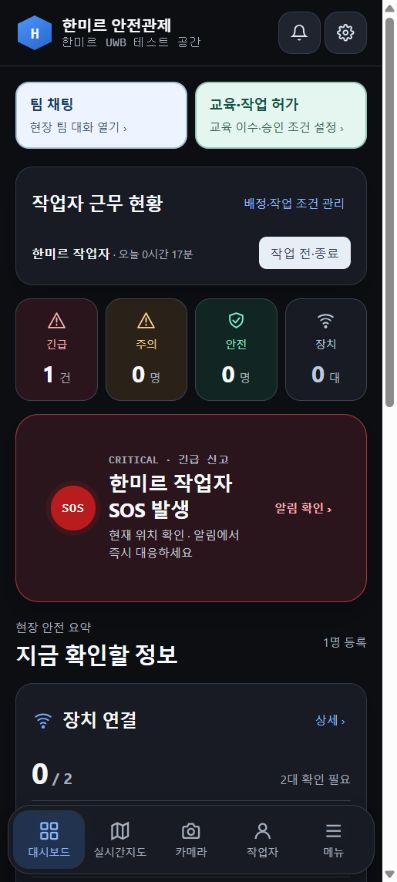

# 앱 글자·배경 대비 수정

## 원인과 수정

밝은 웹 카드와 모바일 다크 테마의 글자색이 섞여 제목·보조 문구·상태 값이 잘 보이지 않았습니다. `frontend/src/contrast.css`를 공통 색상 기준으로 추가하고 기존 테마 뒤에서 적용합니다.

- 관리자 홈: 팀 채팅·교육/허가 카드, 근무 상태, 장치 수, SOS 표시.
- 전체 관리자 메뉴: 화면 제목 보조 문구, 위험 등급, 구역 상세 값, 진단 수신 기록, AI 안내, 재생 시간, 지도 설계 문구.
- 지도·위치 기록·설계도: 밝은 지도에는 진한 텍스트 채움색 지정.
- 근로자: 홈·위치·작업·채팅·알림·정보, 달력 선택 날짜, 비상 상태 하단 메뉴, 보조 문구.
- 앞선 수정 포함: 알림·SOS·서버 설정 팝업, 채팅·교육/허가 편집, 전체 메뉴.

## 검증

실제 브라우저 412px 모바일 화면에서 관리자 13개 경로를 순회하여 렌더링된 글자색과 조상 배경의 대비를 검사했습니다. 발견된 문제 수정 후 검사에서 4.5:1 미만 항목은 남지 않았습니다. 근로자 6개 탭도 검사했고 비상 홈·작업 화면을 수정 후 재검사했습니다. 820px 근로자 화면도 확인했습니다.

검사는 현재 DB에 표시되는 화면 기준이며, 비활성 버튼은 대상에서 제외했습니다. 이미지·그라데이션·SVG의 실제 배경 전체를 픽셀별 측정하는 도구는 아니므로 화면 확인을 함께 수행했습니다. 새로운 데이터로만 나타나는 모든 경우를 보장하는 결과는 아닙니다. 실제 DB의 SOS·근무·교육 기록을 변경하지 않았습니다.

공통 CSS 수정 후 웹 빌드, Android 리소스 동기화 및 APK 업데이트 설치로 적용합니다. 기존 앱 데이터는 유지합니다. 이번 UI 수정에 서버 로직 변경은 없습니다.

