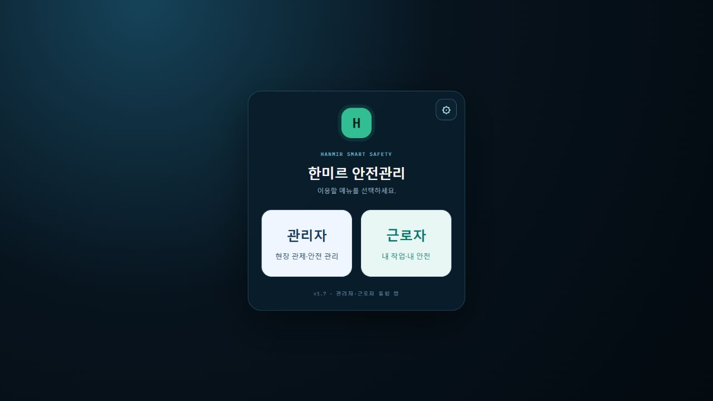
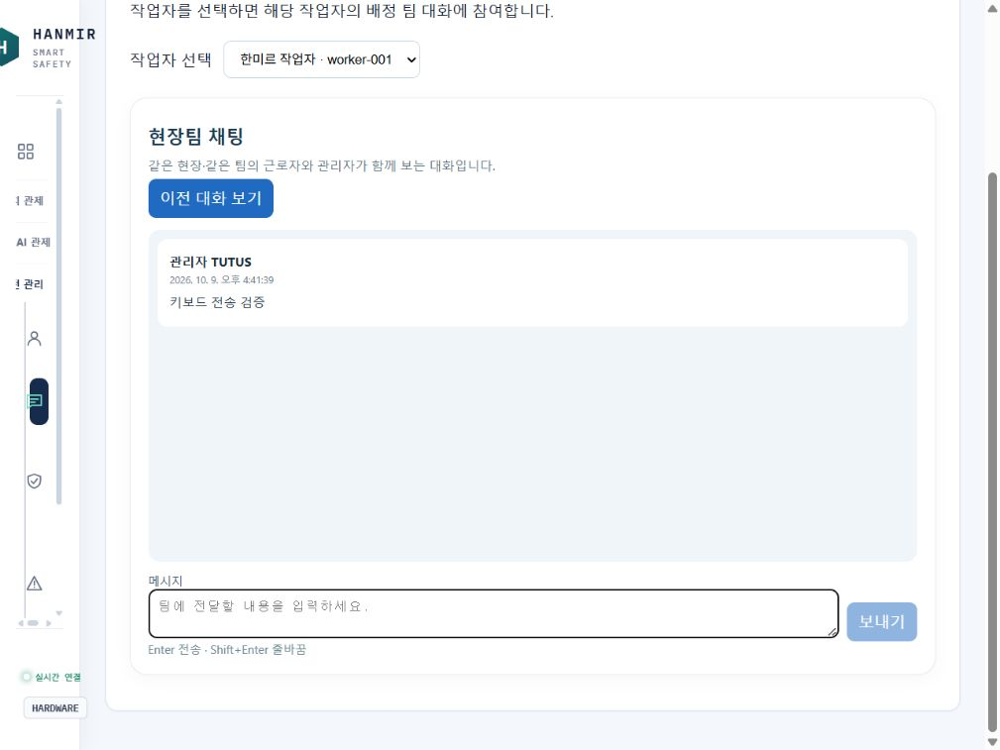

# 안전모 관제·근로자 앱 작업 인수인계

작성일: 2026-10-09 (한국 시간)
앱 버전: v1.7.0 / native build 8
공유 브랜치: `codex/integrated-worker-app-20261009`

기반 로컬 브랜치: `codex/mobile-app-handoff-20261006`

## 1. 작업 개요

하드웨어·관제·모바일 작업물을 로컬 프로젝트에 통합하고 근로자 앱 기능을 확장했습니다. 웹·폰·아이패드는 같은 역할의 계정으로 동일한 기능과 서버 데이터를 사용하며 화면 배치만 다릅니다. 관리자와 근로자의 권한 구분은 유지합니다.

통합 기준은 다음과 같습니다.

| 작업물 | 사용 내용 |
|---|---|
| `codex/mobile-app-handoff-20261006` (`0191964`) | 로컬 하드웨어 기준 |
| `codex/hanmir-final-v1.5-build6-20261007` (`587a5a4`) | 브랜치에 포함된 ZIP의 최신 모바일·iPad 소스 |
| `feature/mobile-safety-app-20261001` (`8d9fbc6`) | P4 펌웨어·음성·카메라 보완 |

작업 코드는 위 공유 브랜치에 커밋하여 전달합니다. main 병합·수정과 스토어 배포는 수행하지 않습니다. 팀원은 공유 브랜치를 체크아웃한 뒤 아래 실행 절차를 따르세요.

## 2. 추가한 근로자 기능

| 기능 | 구현 내용 |
|---|---|
| 로그인·회원가입 | 첫 화면에서 왼쪽 관리자 / 오른쪽 근로자 선택 후 해당 로그인·가입 화면 진입. 선택과 다른 역할 계정은 로그인 제한 |
| 근무 상태 | 작업 시작·휴식·재개·종료 기록, 관리자 화면에서도 근무 상태 확인 |
| 안전 체크리스트 | 시작 전 안전모·조끼·장갑 착용 확인. 서버에서도 모두 확인했는지 검증하고 기록 저장 |
| 작업 중 표시 | 파란 배경과 모든 탭 상단의 상태·오늘 누적 작업시간 |
| 내 위치 | 안전모 UWB 현장 좌표와 배치도 표시. 신호가 오래되면 마지막 위치로 안내 |
| 근로시간 달력 | 월 이동·일자 선택·날짜별 시간과 시작/휴게/재개/종료 기록. 한국 시간 기준, 휴게 제외, 자정 넘긴 작업 날짜별 분리 |
| 팀 채팅 | 같은 현장·배정 팀의 관리자와 근로자 대화, 서버 저장·이전 대화 조회 |
| 교육·작업 허가 | 본인 이수·승인·필수 조건·만료일 확인. 필수 미충족 시 시작·재개 제한 |
| 내 정보 | 이름·현장·회사·팀·직책·작업자 ID |
| 배터리 | 최근 수신한 안전모 배터리 20%·10%·5% 이하 단계별 충전 알림 |

초기 근로자 계정은 `WORKER / 0000`입니다. 실제 배정 및 교육 이수 정보는 관리자가 확인 후 입력해야 합니다.

## 3. 후속 UI·통화·긴급 기능 수정

### 공통 메뉴 및 채팅

- 관리자 웹 사이드바와 모바일 메뉴에 **팀 채팅**, **교육·작업 허가** 독립 메뉴 추가. 대시보드 바로가기 제공.
- 관리자 통화·방송·화재 제어를 화면 크기에 관계없이 제공.
- 채팅 **Enter 전송 / Shift+Enter 줄바꿈**. 한글 조합 확정 엔터 및 중복 전송 방지.
- 달력의 ‘조회 월’ 문구 제거, 이전/다음 버튼과 월 선택 높이·중앙 정렬 수정.

### 관리자 통화

근로자 채팅 제목 옆 **관리자 통화** 버튼 → `/api/worker-app/call-manager` → 기존 `call_manager` 요청·응답 대기·부재중 처리 → 관리자 수신 후 안전모 양방향 통화 흐름입니다.

일반 전화번호로 거는 기능은 아닙니다. 연결된 안전모의 마이크/스피커를 사용하며 오프라인이면 안내합니다. 관리자 통화 티켓은 로그인한 관리자와 같은 현장 장치에만 발급합니다.

### SOS

- 앱 SOS를 기존 관리자 긴급 배너·카메라 팝업에 연결했습니다.
- 관리자 화면에서 통화·신고 확인·상황 종료 제공.
- SOS에 안전모 장치와 `emergency` intent를 연결하고 중복 미종료 요청 재사용.
- 신고 확인만으로 긴급 상태를 해제하지 않고 **상황 종료** 시 해제합니다.
- 카메라가 없어도 SOS 접수 가능. 영상 없으면 기존 `No Frame` 표시 사용.

### 비상 색상 오류 수정

이전 근로자 화면은 `worker.emergency`만 확인해 위험 등급이 ‘비상’이어도 녹색일 수 있었습니다.

- SOS 긴급 상태 또는 **비상 등급**: 빨간 카드·상단 배너, 모든 탭의 비상 경고 안내.
- **위험 등급**: 빨간 카드·상단 배너.
- 주의·관심: 주황색 카드. 정상: 녹색 카드.
- 위험/비상 화면 색은 작업 중 파란 배경보다 우선합니다.

### 카메라 무신호

공통 `CameraFrame`에서 영상 없음 상태를 표시하고 새 프레임 수신 시 화면을 복구하도록 처리했습니다. 카메라 부재 시 반복 이미지 요청으로 화면이 깜빡이는 문제를 보완했습니다. 실제 카메라 스트림 재연결은 하드웨어로 확인해야 합니다.

## 4. 주요 파일

| 파일 | 역할 |
|---|---|
| `frontend/src/components/mobile/LoginScreen.tsx` | 역할 선택·로그인·회원가입 |
| `frontend/src/components/mobile/WorkerApp.tsx` | 근로자 탭·근무·SOS·배터리·비상 표시 |
| `frontend/src/components/mobile/worker-app.css` | 근로자 UI·상태 색·달력 정렬 |
| `frontend/src/components/mobile/WorkCalendar.tsx` | 날짜별 기록 |
| `frontend/src/components/mobile/WorkerMap.tsx` | 본인 현장 위치 |
| `frontend/src/components/TeamChat.tsx` | 공통 채팅·키보드 전송·근로자 통화 요청 |
| `frontend/src/adminNavigation.ts` | 공통 관리자 메뉴 정의 |
| `frontend/src/components/AdminTeamPage.tsx` | 독립 채팅·교육/허가 화면 |
| `frontend/src/components/WorkerOperations.tsx` | 소속·직책·교육/허가 편집 |
| `frontend/src/App.tsx` | 관리자 긴급 배너·카메라 팝업·통화 연결 |
| `backend/app/routers/worker_app.py` | 근로자 전용 API·SOS·통화 요청 |
| `backend/app/routers/events.py` | SOS 확인·상황 종료 |
| `backend/app/services/worker_operations.py` | 근무 계산·배정·조건 판정 |
| `backend/app/websocket/call_manager.py` | 기존 안전모 통화 중계·부재중 처리 |

추가 테이블: `worker_assignments`, `worker_qualifications`, `team_messages`. 실제 DB `backend/safety.db`의 기존 계정·기록을 유지했습니다. 검증용 데이터는 별도 임시 DB를 사용했습니다.

## 5. 실행·업데이트 방법

프로젝트 루트에서 PowerShell 터미널 두 개를 사용합니다.

백엔드:

```powershell
cd backend
.\.venv\Scripts\python.exe -m uvicorn app.main:app --host 0.0.0.0 --port 8000
```

프론트엔드:

```powershell
cd frontend
npm.cmd run dev
```

- PC 접속: `http://localhost:5174`.
- 폰·아이패드: PC와 같은 Wi-Fi에서 `http://<PC의 현재 IPv4>:5174`.
- 마지막 확인 IP는 `192.168.0.223`이지만 **네트워크 변경 시 재확인**하세요. Vite의 `Network` 주소 또는 `ipconfig` 참고.
- 프론트엔드 기본 포트는 `frontend/vite.config.ts`의 **5174**, `strictPort: true`입니다. 사용 중이면 자동 변경되지 않습니다.
- 개발 서버는 `/api`, `/captures`, `/ws`를 로컬 백엔드 8000으로 프록시합니다. 앱 서버 설정에 예전 IP나 임시 테스트 서버 주소가 남아 있으면 현재 백엔드 주소로 바꿔야 합니다.
- 코드 적용 후 서버 재시작 및 `Ctrl+F5`. 설치형 앱은 새 네이티브 빌드 재설치 필요.

웹 빌드·네이티브 리소스 동기화:

```powershell
cd frontend
npm.cmd run build
npx.cmd cap sync
```

`cap sync`는 Android/iOS 프로젝트 리소스 반영이며 APK/IPA 생성 또는 설치 완료를 의미하지 않습니다.

### 오늘 발생한 실행 문제

`Port 5174 is already in use`는 포트 중복 실행 오류입니다. 기존 Vite 프로세스를 확인하고 종료한 후 한 개만 실행하세요.

`Ctrl+C` 이후 ‘일괄 작업을 끝내시겠습니까?’에 `N`을 눌러도 Vite가 이미 중단됐을 수 있습니다. PowerShell 입력 줄로 돌아왔다면 서버가 실행 중인지 확인해야 합니다.

마지막 접속 장애 확인 당시 백엔드 8000은 정상, 프론트엔드 5174는 중단 상태였습니다. 프론트엔드를 백그라운드로 재실행하여 HTTP 200을 확인했습니다. 로그는 `frontend/vite-dev.stdout.log`, `frontend/vite-dev.stderr.log`입니다. 이 실행 상태는 이후 재부팅·종료에 따라 달라질 수 있습니다.

## 6. 검증 결과와 범위

- 공통 기능·메뉴 수정 후 `pytest tests -q`: **93개 통과**.
- 이후 통화 요청·SOS 종료 수정의 관련 테스트: **9개 통과**. GitHub 공유 직전 전체 서버 테스트를 다시 실행하여 **94개 통과** 확인.
- 마지막 비상 색상 수정: TypeScript·Vite 빌드 성공, 이후 Android/iOS 동기화 완료.
- 브라우저에서 역할 선택 화면, Enter 전송·Shift+Enter 줄바꿈, PC/폰/태블릿 크기 메뉴·달력과 기존 근로자 기능 확인.
- 마지막 비상 색상 수정은 빌드 확인까지 수행했으며 실제 안전모 비상 신호를 이용한 화면 검증은 남아 있습니다.
- 별도 YOLO/웹캠 실험 스크립트는 `ultralytics`/`cv2` 미설치로 루트 전체 pytest 수집 시 오류가 납니다. 자동화 테스트는 `backend`에서 `.\.venv\Scripts\python.exe -m pytest tests -q`로 실행하세요.

## 7. 다음 팀원 확인 사항

1. 실제 안전모 연결 후 근로자 통화 요청 → 관리자 수신 → 양방향 음성 → 통화 종료·부재중 처리 확인.
2. 앱 SOS → 관리자 카메라 팝업/배너 → 신고 확인 → 상황 종료 → 근로자 상태 해제 확인.
3. 위험·비상 등급에서 빨간색 표시 및 다른 탭 이동 시 경고 유지 확인.
4. 카메라 중단·복구 시 `No Frame` 전환과 복구 확인.
5. 실제 Android/iPad 새 빌드 설치 및 같은 현장 데이터 공유 확인.
6. 공유 브랜치를 기준으로 후속 작업하세요. 실제 DB·비밀 설정·가상환경·실행 로그는 제외되어 있으므로 각 팀원의 로컬 환경을 설정해야 합니다.

배터리 알림은 앱 실행 중 알림이며 OS 백그라운드 푸시는 아닙니다. 위치 지도는 휴대폰 GPS가 아닌 UWB 기준입니다. 교육 강의·시험 기능은 없으며 이수/허가는 관리자 확인 기록입니다.

## 8. 참고 문서·화면

- [근로자 기능 상세](근로자앱_기능확장_2026-10-09.md)
- [근로자 앱 실행 안내](근로자앱_실행안내.md)
- [브랜치 비교·통합 기록](브랜치_비교_업데이트_2026-10-09.md)




